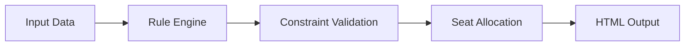

# 🎓 Exam Seat Allocation System

> An intelligent seating arrangement generator for academic examinations, built with rule-based logic and automation principles.


---

## 📋 Overview

This system automates the process of generating exam seating arrangements by applying predefined rules and constraints. Developed as an academic mini-project, it demonstrates practical problem-solving approaches to a common institutional challenge.

**Key Features:**
- ✅ Automated seat allocation based on roll numbers
- ✅ Room capacity constraint handling
- ✅ Interactive GUI for easy operation
- ✅ Clean HTML output for printing and distribution
- ✅ Rule-based logic engine

---

## 🎯 Project Scope

This academic utility focuses on:

- **Automation** - Eliminates manual seating arrangement creation
- **Constraint Satisfaction** - Respects room capacity and distribution rules
- **User Experience** - Simple GUI for non-technical users
- **Output Quality** - Professional HTML-formatted seating charts

> **Note:** This is an academic prototype designed for learning purposes, not a production-ready enterprise system.

---

## 🛠️ Technologies Used

| Technology | Purpose |
|------------|---------|
| **Python 3.x** | Core logic and automation |
| **Tkinter/GUI Framework** | User interface |
| **HTML/CSS** | Seating arrangement output |

---

## 📁 Repository Structure

```
exam-seat-allocation-system/
│
├── 📄 main.py                      # Core allocation logic
├── 🖥️ gui.py                       # Graphical user interface
├── 📊 seating_arrangements.html    # Generated output file
├── 🚫 .gitignore                   # Git exclusions
└── ⚙️ configuration files          # Project setup
```

---

## 🚀 How It Works



1. **Input Phase** - Student data and exam details are provided
2. **Processing** - Rule-based logic assigns seats respecting constraints
3. **Validation** - System ensures no conflicts or violations
4. **Output** - Generates formatted seating arrangement
5. **Export** - HTML file ready for printing/distribution

---

## 💡 My Contribution

As part of this academic project, I focused on:

- 🔍 **Analysis** - Understanding seat allocation logic and constraint requirements
- 🧪 **Testing** - Validating outputs and edge case handling
- 📖 **Documentation** - Creating clear project structure and usage guidelines
- 🔄 **Workflow Design** - Mapping system behavior and data flow

*This project includes collaborative academic code developed as part of coursework.*

---

## 🎓 Learning Outcomes

This project helped develop understanding of:

- Rule-based systems and constraint satisfaction
- GUI development and user interaction design
- Automated report generation
- Real-world problem abstraction and solution design
- Software documentation practices

---

## ⚙️ Installation & Usage

```bash
# Clone the repository
git clone https://github.com/yourusername/exam-seat-allocation-system.git

# Navigate to project directory
cd exam-seat-allocation-system

# Run the application
python gui.py
```

---

## 📸 Screenshots

*Add screenshots of your GUI and generated seating arrangement here*

---

## 🔮 Future Enhancements

- [ ] Support for multiple exam sessions
- [ ] Database integration for student records
- [ ] PDF export functionality
- [ ] Advanced conflict resolution algorithms
- [ ] Web-based interface
- [ ] Analytics and reporting dashboard

---

## ⚠️ Disclaimer

**This project is intended strictly for academic and learning purposes.**

The implementation serves as a proof-of-concept and may require significant enhancements for:
- Scalability in large institutions
- Security and data privacy compliance
- Production deployment requirements
- Advanced edge case handling

---

## 📄 License

This project is available under the MIT License - see the LICENSE file for details.

---

## 🤝 Contributing

While this is primarily an academic project, suggestions and feedback are welcome! Feel free to:

- Open issues for bugs or suggestions
- Submit pull requests for improvements
- Share your own implementations or variations

---

## 📬 Contact

For questions or collaboration opportunities:

- **GitHub Issues** - Use the issue tracker for project-related questions
- **Email** - [abelchacko991@gmail.com]

---

<div align="center">

**Made with 💙 for academic learning**

⭐ Star this repo if you found it helpful!

</div>
